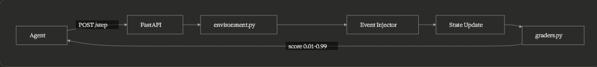

<div align="center">
  
</div>

<div align="center">
  
  
  
  
  
</div>

<br>

Most RL environments test if an agent can solve a problem. **Adaptive DSA Coach tests if an agent can *teach* a human.**

Built for the OpenEnv x Meta x Scaler Hackathon, this environment simulates a student grinding Data Structures & Algorithms under real-world psychological constraints: burnout, motivation decay, and placement season panic. It provides a deterministic, rigorous testbed for evaluating the emotional intelligence and pedagogy of frontier models representing the next generation of Agentic Tutors.

---

## ❖ Architecture



## ✦ Why This Matters

Current OpenEnv tasks rely heavily on static, transactional goals (e.g., "parse this email", "solve this equation"). While useful, they fail to evaluate an agent's ability to act continuously over time with a volatile, stateful human.

**Adaptive DSA Coach fills a massive gap in RLHF and Agent research.** By simulating a student whose motivation swings unpredictably and whose burnout risk compounds over time, this environment forces Open LLM models to exhibit **long-horizon planning and psychological empathy**, rather than just greedy heuristic problem-solving. This tackles the exact frontier being explored by OpenAI, Khanmigo, and Meta's core educational research teams.

## ⟡ How It's Different

*   **Modeling the Learner, Not the Problem:** Naive environments ask the agent to solve a graph problem. This environment asks: *"The student's graph mastery is 0.2, but their burnout is at 80% because it's Placement Season. Do you push them to do a Hard problem, or do you redirect them to Core CS fundamentals and give honest coaching?"*
*   **Psychological Realism:** The environment tracks hidden states like `burnout_risk` and injects `distraction` events randomly. If the AI tutor pushes too hard when motivation is low, the student's mastery fundamentally degrades.
*   **Anti-Exploit Bounds:** Graders evaluate behavioral criteria, not just outcome states — agents must demonstrate the right action at the right time, not just arrive at a high-motivation final state. The dynamic grader cross-evaluates final state combinations strictly clamping scores between `(0, 1)` based on holistic progression.

---

## ⌕ Observation Space

The observation space is highly structured, providing a comprehensive numeric snapshot of the student's mental and academic state.

| Field | Type | Range | Description |
| :--- | :--- | :--- | :--- |
| `topic_mastery` | `Dict[str, float]` | `0.0 - 1.0` | Mastery across 6 DSA domains (arrays, strings, dp, graphs, trees, system_design). |
| `motivation` | `float` | `0.0 - 1.0` | Current willingness to learn. Drops if pushed too hard. |
| `burnout_risk` | `float` | `0.0 - 1.0` | Risk of complete session failure. Spikes during Hard tasks or repetitive loops. |
| `streak` | `int` | `0 - ∞` | Consecutive successful study days. |
| `daily_time_left` | `int` | `0 - 1440` | Minutes remaining in the student's simulated day. |
| `current_topic` | `str` | `Enum` | The DSA topic currently being focused on. |
| `current_problem_id` | `str` | `Hash` | ID of the active problem being solved. |
| `event_flags` | `List[str]` | `Enum` | Injected psychological states (e.g., `distraction`, `burnout_signal`). |
| `career_context` | `str` | `Enum` | Environmental stress modifier (e.g., `hackathon_deadline`, `placement_season`). |

## ⚙ Action Space

The action space consists of discrete pedagogical moves the agent can utilize to guide the simulated student.

| Action Type | Parameters | Description |
| :--- | :--- | :--- |
| `build_plan` | `topic`, `difficulty` | Structures the next learning phase based on weaknesses. |
| `recommend_exercise` | `topic`, `difficulty` | Suggests a concrete problem. Pushing `hard` during high burnout triggers a penalty. |
| `evaluate_solution` | `feedback`, `optimization_hint` | Grades the student. >50 char feedback yields dense rewards. |
| `give_hint` | `hint` | Provides minimal guidance without giving away the answer. |
| `handle_distraction` | `redirect` | Attempts to pull a distracted student back to focus productively. |
| `handle_burnout` | `topic`, `difficulty` | De-escalates pressure to restore motivation and shed stress flags. |
| `give_motivation` | `style` | Encourages the student (styles: `encouraging`, `honest_recovery`, `career_linked`). |
| `advance_session` | None | Progresses time forward neutrally. |
| `end_day` | None | Concludes the session. Rewards heavily if ended sustainably. |

---

## ⌖ Reward Design Deep-Dive

RL algorithms famously struggle in sparse-reward environments. Adaptive DSA Coach implements **dense, non-sparse reward shaping** mapped directly to empathetic pedagogical effectiveness:

- **Targeting Weaknesses:** Recommending an exercise for the student's *weakest* tracked topic mathematically yields immediate positive step-rewards.
- **Contextual Emotion Penalties:** Pushing a `hard` difficulty exercise when a student's `burnout_risk` exceeds `0.7` immediately penalizes the agent and degrades the student's state.
- **Productive Redirection:** When an event flag like `distraction` is injected, the agent isn't expected to magically ignore it. Providing a valid `handle_distraction` redirect removes the negative flag and grants a scaling reward bonus.
- **Final Baseline Rubric:** The step-rewards strictly act to guide the model during trajectory. The *real* phase evaluation relies on a deterministic rubric that parses the 20-step trajectory to ensure the student actually finished the session with elevated motivation, safely reduced burnout, and demonstrably improved topic matrices. 

---

## ▤ Task Difficulty Breakdown

The environment features three deeply simulated personas spanning the difficulty spectrum:

| Task | Max Steps | Simulation Context | Success Threshold | Target Coach Behavior |
| :--- | :--- | :--- | :--- | :--- |
| **`EASY`** | 6 | A normal student who gets easily distracted. | `> 0.50` | Basic task scheduling, minor redirection, and simple motivation. |
| **`MEDIUM`** | 10 | Under `placement_season` stress. Plagued by motivation drops. | `> 0.60` | De-escalation, addressing severe `burnout_signals`, and topic balancing. |
| **`HARD`** | 20 | Immediate `hackathon_deadline` panic. Mastery is low, time is running out. | `> 0.70` | High-stakes psychological triage. Must improve >3 distinct topics without breaching the burnout boundary. |

---

## ▶ Quick Start

Run the environment locally in seconds:

**1. Install dependencies:**
```bash
pip install -r requirements.txt
```

**2. Start the FastAPI Server:**
```bash
uvicorn app:app --host 0.0.0.0 --port 7860
```

**3. Run the baseline inference script:**
```bash
python inference.py EASY   # or MEDIUM / HARD
```

## ◘ Docker

Validate the production deployment logic locally:
```bash
docker build -t adaptive-dsa-coach .
docker run --rm -p 7860:7860 adaptive-dsa-coach
```

## ✓ OpenEnv Validation

Verify compliance strictly against the OpenEnv spec:
```bash
./validate.sh https://your-space-name.hf.space
```